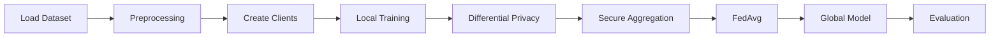
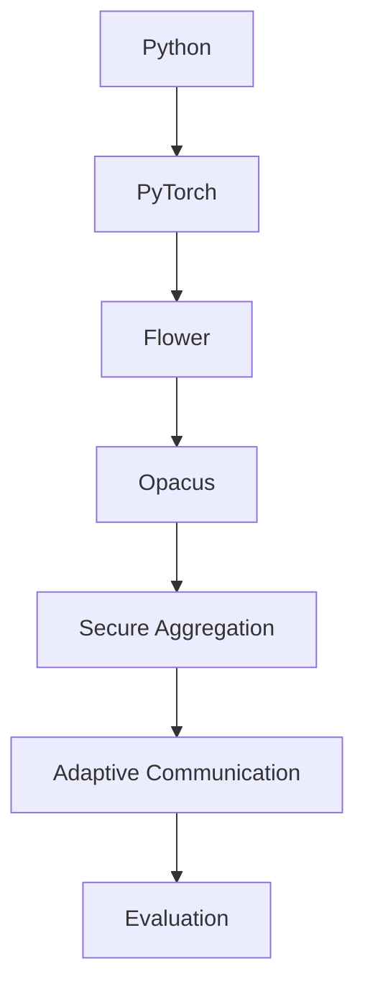
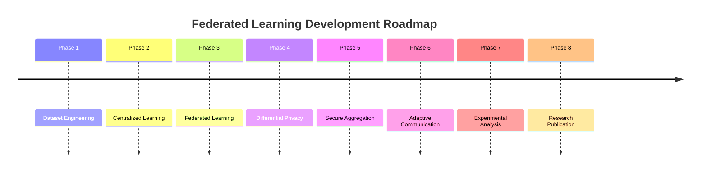
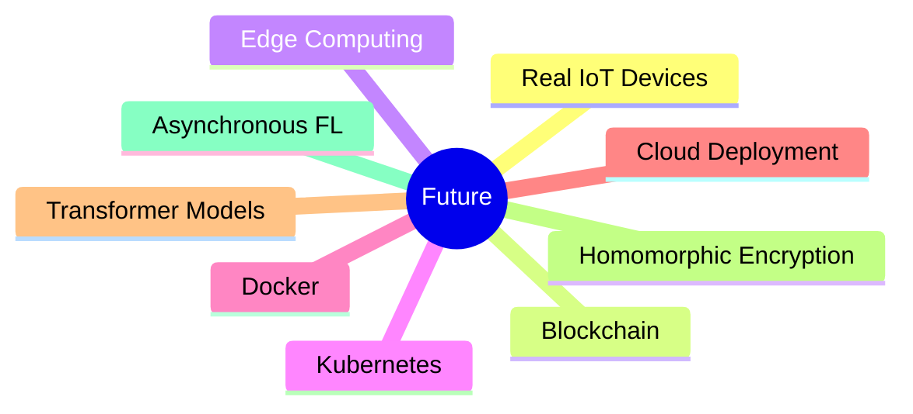

<div align="center">

# 🔐 Privacy-Preserving Federated Learning
### Secure IoT-Based Distributed Data Analytics


[]()
[]()
[]()
[]()
[]()

Building privacy-preserving distributed machine learning for modern IoT infrastructures.

</div>

---

# 📑 Table of Contents

- Product Vision
- Problem Statement
- Solution
- Product Architecture
- User Journey
- Core Features
- Technology Roadmap
- Product Roadmap
- Market Opportunities
- Competitive Analysis
- Success Metrics
- Future Vision

---

# 🚀 Product Vision

Create an intelligent Federated Learning platform that enables organizations to collaboratively train AI models **without exposing sensitive data**.

The framework combines

- Federated Learning
- Differential Privacy
- Secure Aggregation
- Adaptive Communication

to deliver secure, scalable, and communication-efficient AI for IoT environments.

---

# ❗ Problem Statement

Today's IoT systems generate enormous volumes of sensitive network traffic.

Traditional Machine Learning requires:

```
IoT Devices
      │
      ▼
Upload Raw Data
      │
      ▼
Central Server
      │
      ▼
Model Training
```

This introduces

❌ Privacy Risks

❌ High Communication Cost

❌ Regulatory Challenges

❌ Single Point of Failure

❌ Security Vulnerabilities

---

# 💡 Our Solution

Instead of moving data,

we move **knowledge**.

```
            Global Model
                 │
                 ▼
      ┌────────────────────┐
      │   Flower Server    │
      └────────────────────┘
         ▲      ▲      ▲

   Model Updates Only

┌─────────┐ ┌─────────┐ ┌─────────┐
│ Client1 │ │ Client2 │ │ Client3 │
└─────────┘ └─────────┘ └─────────┘

Local Data Never Leaves Device
```

---

# 🏗 Product Architecture

```text
                Dataset
                   │
                   ▼
         Data Engineering
                   │
                   ▼
          Feature Engineering
                   │
                   ▼
        IID / Non-IID Partition
                   │
         ┌─────────┴─────────┐
         ▼                   ▼
     Flower Client       Flower Client
         │                   │
         ▼                   ▼
     Local Training     Local Training
         │                   │
         ▼                   ▼
 Differential Privacy  Differential Privacy
         │                   │
         └─────────┬─────────┘
                   ▼
          Secure Aggregation
                   │
                   ▼
             Flower Server
                   │
                   ▼
                FedAvg
                   │
                   ▼
      Adaptive Communication
                   │
                   ▼
            Global Model
                   │
                   ▼
             Performance
             Evaluation
```

---

# 👥 User Journey



---

# ✨ Core Features

| Feature | Description |
|----------|-------------|
| 🌐 Federated Learning | Distributed collaborative training |
| 🔒 Differential Privacy | Prevents information leakage |
| 🛡 Secure Aggregation | Protects model updates |
| ⚡ Adaptive Communication | Reduces bandwidth consumption |
| 📊 Experiment Dashboard | Evaluation & comparison |
| 📁 Modular Architecture | Easy to extend |
| 📈 Performance Metrics | ML + System evaluation |
| 🔬 Research Ready | Suitable for publication |

---

# 🎯 Target Users

```text
Researchers
        │
Cybersecurity Teams
        │
IoT Companies
        │
Healthcare
        │
Smart Cities
        │
Industrial IoT
        │
Universities
```

---

# 🛠 Technology Roadmap



---

# 🗺 Product Roadmap



---

# 📊 Product Maturity

| Phase | Status |
|--------|--------|
| Data Engineering | ✅ |
| MLP Baseline | ✅ |
| Federated Learning | ✅ |
| Differential Privacy | 🚧 |
| Secure Aggregation | 🚧 |
| Adaptive Communication | 🚧 |
| Experimental Analysis | ⏳ |
| Research Publication | ⏳ |

---

# 📈 Market Opportunity

```text
AI
│
├── Machine Learning
│
├── Federated Learning
│     │
│     ├── Healthcare
│     ├── Banking
│     ├── IoT
│     ├── Edge AI
│     └── Cybersecurity
```

---

# ⚖ Competitive Analysis

| Capability | Traditional ML | Federated Learning | This Project |
|------------|---------------|-------------------|--------------|
| Raw Data Sharing | ✅ | ❌ | ❌ |
| Differential Privacy | ❌ | Partial | ✅ |
| Secure Aggregation | ❌ | Partial | ✅ |
| Adaptive Communication | ❌ | Rare | ✅ |
| IoT Focus | Limited | Medium | ✅ |
| Research Ready | Medium | High | ⭐ |

---

# 📊 Success Metrics

### Machine Learning

- Accuracy
- Precision
- Recall
- F1 Score
- ROC-AUC

---

### System

- Communication Cost
- Aggregation Time
- Memory Usage
- CPU Usage
- Network Latency
- Bandwidth Savings

---

# 🚀 Future Vision



---

# 🌍 Real-World Applications

🏥 Smart Healthcare

🏭 Industry 4.0

🚗 Connected Vehicles

🏙 Smart Cities

🏦 Banking & Finance

📡 Edge AI

🛰 Industrial Monitoring

---

# 🏆 Research Contributions

✅ Privacy-Preserving AI

✅ Federated Learning

✅ Secure Aggregation

✅ Differential Privacy

✅ Adaptive Communication

✅ Distributed Machine Learning

---

<div align="center">

## ⭐ Building the Future of Privacy-Preserving AI

*"Train Together. Keep Data Private."*

</div>
